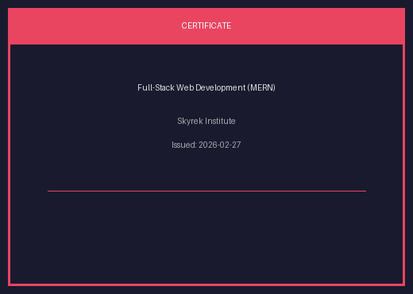
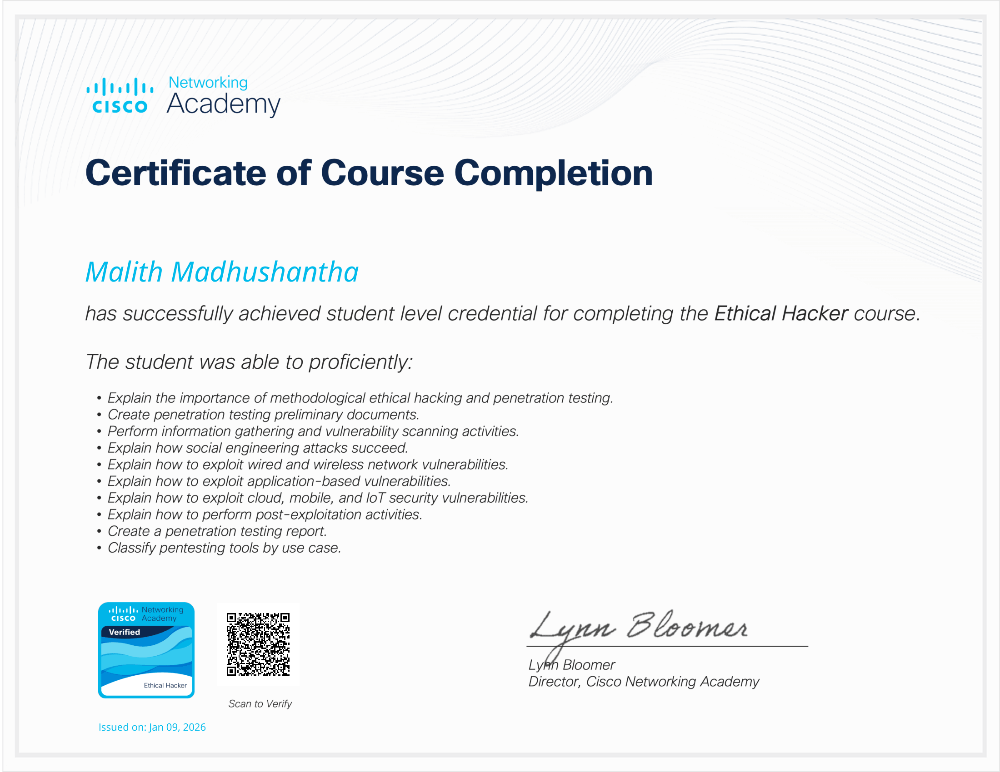
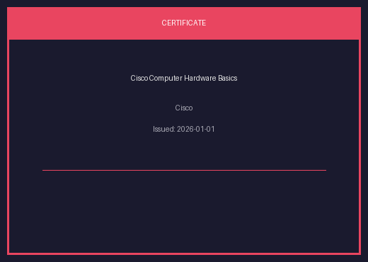
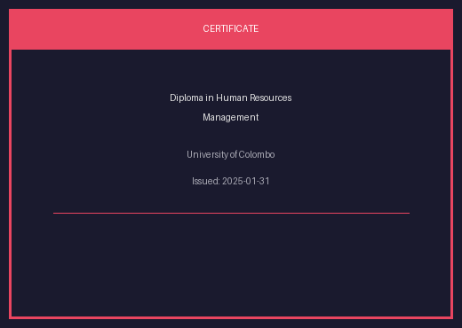

<h1 align="center">👨‍💻 Malith Madhushantha</h1>
<h3 align="center">🚓 Sri Lanka Police Officer | 💻 Fullstack Developer | 🛡️ Cybersecurity Enthusiast</h3>

  
  

---

## 👋 About Me

✔ Sri Lanka Police Officer  
✔ Fullstack Web & Mobile Application Developer  
✔ Cybersecurity & Ethical Hacking Enthusiast  
✔ MERN Stack Developer  
✔ IT Systems & Network Troubleshooting  
✔ Secure Application Development Research  

🎯 Currently working on secure digital solutions and intelligence reporting systems.

---

## 🎓 Educational Qualifications

- Diploma in Human Resources Management — University of Colombo  
- Certificate in Fullstack Web Development (MERN) — Skyrek Institute  
- Cisco Certified Ethical Hacker  
- Cisco Computer Hardware Basics  

### ⏳ Pending
- Diploma in Information Technology — NYSCO Education Institute  
- Advanced Certificate in Cybersecurity and Ethical Hacking — Oxford Graduate Campus  

---

## 🏆 Certifications

<table>
<tr>
<td align="center">
 
<b>Full-Stack Web Development (MERN)</b> 
Skyrek Institute 
Issued: 2026-02-27 
<a href="https://certificate.skyrek.com/certifcates/completion/cSCY5rCs6QvT">Verify</a>
</td>

<td align="center">
 
<b>Cisco Verified Ethical Hacker</b> 
Issued: 2026-01-09 
<a href="https://www.credly.com/badges/c0b370b1-0235-4b20-ba8f-505d6173179e/public_url">Verify</a>
</td>
</tr>

<tr>
<td align="center">
 
<b>Cisco Computer Hardware Basics</b> 
Issued: 2026-01-01 
<a href="https://www.credly.com/badges/1b3ea672-7334-4ba3-a7e3-6665f23c802d/public_url">Verify</a>
</td>

<td align="center">
 
<b>Diploma in Human Resources Management</b> 
University of Colombo 
Issued: 2025-01-31
</td>
</tr>
</table>

---

## 💼 Professional Experience

### 👮 Sri Lanka Police
Police Officer — Present

### 💻 ezofz.web.lk
Fullstack Developer

- Web application development  
- REST API development  
- Responsive UI implementation  
- Database design & management  
- System deployment & maintenance  

---

## 🛠️ Technical Skills

### Frontend
HTML5 • CSS3 • JavaScript • React • Quasar

### Backend
Node.js • PHP • Laravel • REST APIs

### Mobile Development
Flutter • Cordova • Capacitor

### Databases
MySQL • MongoDB

### Cybersecurity
Ethical Hacking • Network Security • Vulnerability Assessment • Secure Coding

### Tools & Platforms
Git • GitHub • VS Code • Linux • Postman • Figma

---

## 🚀 Current Projects

### ezofz.web.lk
https://ezofz.web.lk

### Asali Frontend
https://asali-frontend.vercel.app/

### Secure Intelligence Reporting System (R&D)
Confidential Public Tip Submission Mobile Platform

---

## 📊 GitHub Analytics

  
  
  

---

## 🌐 Connect With Me

  
  
  

---

  

